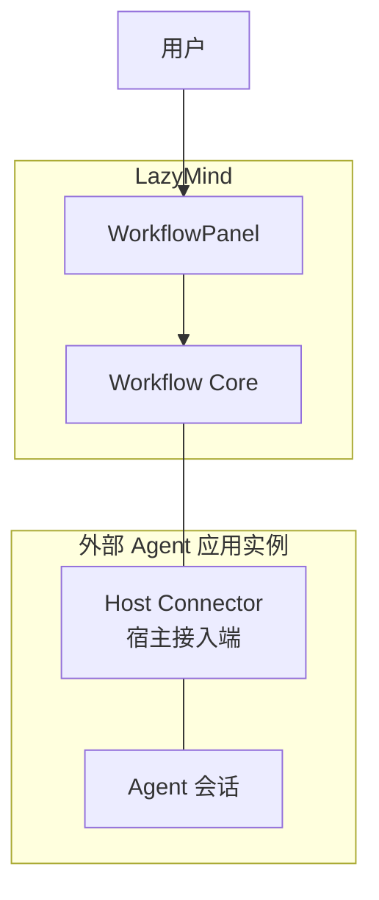
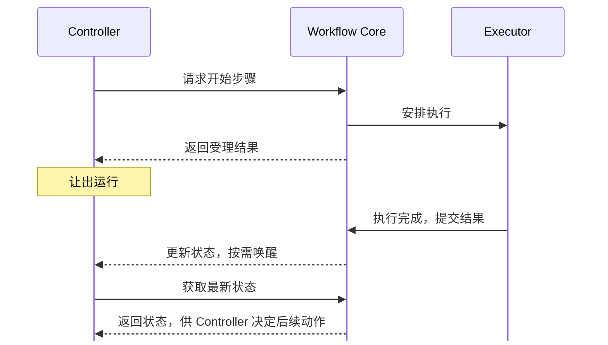
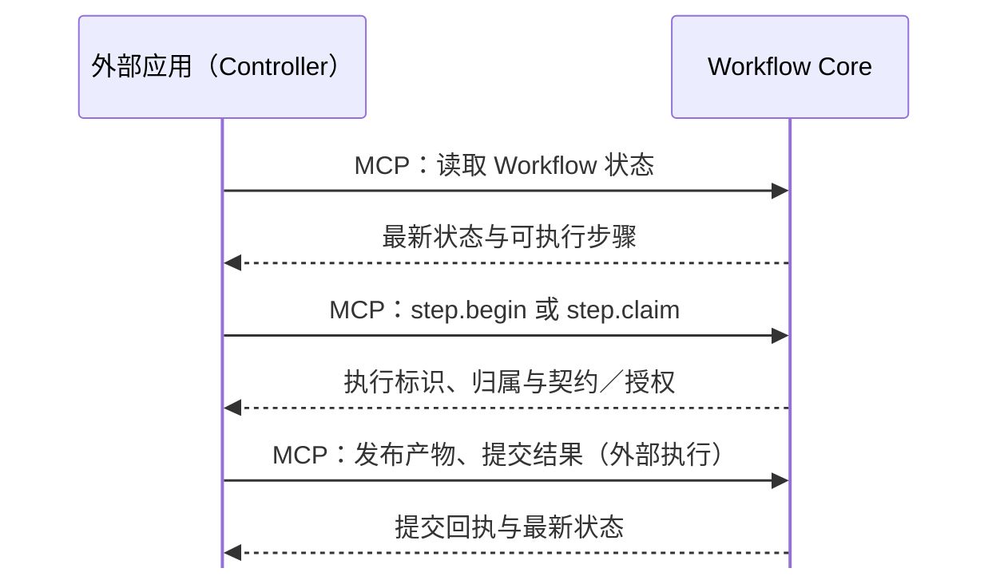
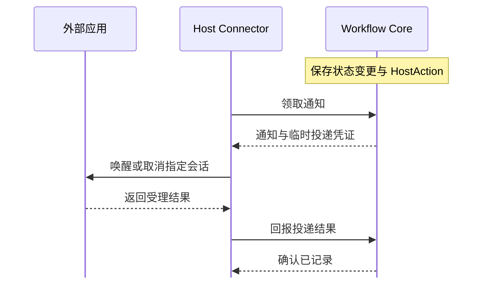

# 外部 Agent 与 Workflow 交互协议（草案）

> 状态：草案。定义参与方、通信通道、会话绑定，以及通知投递、执行授权和宿主运行控制的协议。

## 1. 总体架构

用户通过 WorkflowPanel 提交审核、继续、停止等操作。Core 管理 Workflow，Host Connector 将控制通知送到外部应用的指定 Agent 会话。

<div style="display: flex; flex-wrap: wrap; align-items: flex-start; gap: 24px;">

<div style="flex: 0 0 260px;">

**参与方与应用实例**



</div>

<div style="flex: 1 1 640px; min-width: 0;">

**独立 Executor 的典型时序**



内部通过回调启动 Controller 下一轮，外部通过 HostAction 与 Host Connector 唤醒；同一 Agent 兼任 Executor 时，直接根据提交回执继续推进。

</div>

</div>


## 2. Workflow 与 Agent 会话的对应关系

```text
Workflow run（Run ID） ──绑定──▶ ⎧ 外部 Agent 应用类型（Provider）
                                 ⎨   └─ 已配对实例（Connector ID）· Host Connector（每实例一个）
                                 ⎩       └─ Controller 会话（Driver session ID）
```

## 3. 绑定生命周期

<table>
  <thead>
    <tr><th>情形</th><th>规则</th></tr>
  </thead>
  <tbody>
    <tr>
      <td>尚未建立</td>
      <td><ul>
        <li>Core 可返回 <code>binding_required</code>。</li>
        <li>不向未确定的会话自动投递 HostAction。</li>
      </ul></td>
    </tr>
    <tr>
      <td>建立</td>
      <td><ul>
        <li><code>workflow.start</code> 创建 run。</li>
        <li>获取并记录可定位 Controller 会话的 session ID，以便后续唤醒或取消同一会话。</li>
      </ul></td>
    </tr>
    <tr>
      <td>保留</td>
      <td><ul>
        <li>会话空闲、外部应用重启或暂时离线时，保留原关联。</li>
        <li>Workflow Stop / Resume 时，保留原关联。</li>
        <li>Stop 后仍用原关联定位会话，以便取消、恢复和审计。</li>
      </ul></td>
    </tr>
    <tr>
      <td>无法唤醒会话</td>
      <td><ul>
        <li>已绑定会话不存在或外部应用无法恢复它时，自动唤醒不可用。</li>
        <li>原关联仍保留；不自动改绑到其他会话。</li>
      </ul></td>
    </tr>
  </tbody>
</table>

创建 run 后若绑定失败，重试沿用原 run ID 和幂等标识，避免重复创建。

### 3.1 本版暂不支持

- 不定义在新 Agent 会话中接管旧 Workflow run。
- 不定义跨外部应用转移 Controller。
- 不允许通过打开 WorkflowPanel 或读取 run 状态取得 Controller 绑定。

## 4. 执行控制协议

### 4.1 交互对象

本章围绕 Core、Host Connector、外部应用三个对象描述交互。外部应用通过绑定的 Agent 会话承担 Controller 职责；下文涉及读取状态、申请执行等行为时，“外部应用”指该 Controller 会话，涉及唤醒、取消时指宿主会话接口。

| 对象 | 职责 |
| --- | --- |
| Core | 保存 Workflow 状态和通知，管理投递权，校验执行请求与授权。 |
| Host Connector | 每个已配对外部应用实例的宿主接入端；领取通知、定位会话、适配宿主接口并回报受理结果。 |
| 外部应用 | 管理 Controller 会话的运行；Controller 读取状态并推进 Workflow，宿主按能力暂停或中断运行。 |

Executor 是步骤执行角色，有两种归属：

- **外部 Agent**：Controller 可兼任 Executor，按 Core 返回的步骤契约和授权执行、发布产物、提交结果。
- **LazyMind 内部 Executor**：由 Core 调度；外部 Controller 不取得该步执行授权，让出运行，等待完成通知。

### 4.2 执行流程

**执行通道：外部应用通过 Workflow MCP 直接访问 Core。**



`step.begin(step_id)` 创建并领取一次执行；`step.claim(execution_id)` 领取已有的外部执行，或读取内部执行状态。两者均返回执行信息，不等待步骤完成。外部执行获得 `execution_handle`，通过 MCP 发布产物并提交结果；内部执行只返回归属和状态，不向外部发放执行授权。

外部 Agent 兼任 Executor 时，提交后根据最新状态继续推进；等待审核、等待独立 Executor 或已停止时让出自动运行，完成时结束推进，不轮询等待。

**控制通道：Core 保存 HostAction，Connector 领取并调用外部应用的会话接口。**



Core 的状态变更与相应 HostAction 在同一事务中保存。控制操作先在 Core 生效，不等待外部应用受理；Controller 被唤醒后重新进入执行通道。Connector 不代理 MCP 调用。

### 4.3 控制通道

#### 4.3.1 HostAction 字段

HostAction 是 Core 中的持久化通知，用来定位会话和表达控制意图。

| 字段 | 含义 |
| --- | --- |
| `id` | 通知 ID，用于领取、投递和回执。 |
| `session_id` | Workflow run ID。 |
| `kind` | `continue` 或 `cancel`。 |
| `connector_id` | 目标 Host Connector 的 ID。 |
| `native_session_id` | 目标外部 Agent 会话的 ID。 |
| `execution_id` | 可选，标识 Core 中某个步骤的一次执行。 |

Core 另行记录通知的投递状态 `status`，见 §4.3.5。

#### 4.3.2 `continue`：唤醒 Controller

`continue` 要求 Controller 查看 Workflow 最新状态。通知只发往已绑定的会话；Core 在处理触发动作时判断是否产生通知。

| 发起方与动作 | 产生条件 | HostAction | Core 的处理 |
| --- | --- | --- | --- |
| 内部 Executor 完成步骤 | 无其他活跃执行；Workflow 可继续、已完成或已失败 | `continue`（带 `execution_id`） | 结算执行，更新状态。 |
| 用户 Continue／确认并继续 | 允许继续且无活跃执行 | `continue`；已准备执行时带 `execution_id` | 接受审核结果（如有）；通常在 Controller 调用 `step.begin` 后创建执行。 |
| 用户 Retry／Rewind／Resume | 操作通过校验，且有目标步骤可执行 | `continue`（带 `execution_id`） | 按需解除停止，创建目标步骤的执行。 |

Controller 先读状态：需要等待或已结束时不发起新执行；允许处理时，无 `execution_id` 调用 `step.begin`，有 `execution_id` 调用 `step.claim`。通知可能关联已完成的内部执行，此时查看结果与后续状态，不重复执行该步骤。

`workflow.start`、外部执行提交、产物查看或保存、仅确认审核均不单独产生唤醒。Controller 在当前运行中处理回执；进入人工审核等待时主动让出运行，不另发暂停通知。

允许通知排队或延迟到达，也允许一次多余唤醒；通知不授予执行权限，实际请求以 Core 最新状态为准。

#### 4.3.3 `cancel`：请求宿主中断

用户 Stop 通过校验后，Core 立即停止 Workflow、撤销相关执行授权，并向已绑定会话产生 `cancel`。外部中断按宿主能力处理，取消结果不决定 Core 的 Stop 是否生效。

| 宿主能力 | 处理原则 |
| --- | --- |
| 支持取消指定运行 | 针对属于该 Workflow 的具体运行取消。 |
| 只能取消会话当前运行 | 避免旧取消请求中断恢复后或其他任务的运行。 |
| 不支持取消 | 回报不支持中断，不记录取消成功；Core 的停止仍生效，恢复不以外部中断为前提。 |

#### 4.3.4 控制信息的校验职责

| 环节 | 责任方 | 校验与处理边界 |
| --- | --- | --- |
| 领取通知 | Core | 判断通知是否已处理、是否存在有效投递权、上次投递结果是否明确；同一通知不并发授予投递权。 |
| 接收领取回执 | Connector | 确认获得投递凭证且状态为 `dispatching`，再继续投递。 |
| 调用宿主接口 | Connector | 定位目标会话、适配宿主能力、回报受理结果；不为 `continue` 再次查询或解释 Workflow 状态。 |
| 宿主自动运行 | 外部应用的运行钩子／接入代码 | 根据 Core 状态暂停或放行 Workflow 自动推进，区分用户正常交流和已有执行收尾；不重复校验具体工具请求。 |
| 实际执行请求 | Core | 开始时校验步骤可执行性；领取时校验执行归属与可领取状态；发布、提交时校验执行授权和步骤契约。 |

通知领取不提前校验步骤执行条件。Controller 根据状态选择步骤，MCP 工具负责参数转换与调用；状态过期时由 Core 拒绝不适用的请求，不在工具层重复判断可执行集合。

无运行钩子的宿主通过 Agent 指令要求其先读取状态，并在等待或停止时主动让出运行；执行授权仍由 Core 校验。`cancel` 必须满足 §4.3.3 对取消目标的约束。

#### 4.3.5 投递状态与可靠性

领取成功表示取得投递权；外部应用受理表示接收了会话操作。两者都不表示 Agent 已运行或步骤已完成。

| 投递状态 | 含义与处理 |
| --- | --- |
| `pending` | 待领取，可授予临时投递权。 |
| `dispatching` | 已有 Connector 负责投递，不再授予其他领取者投递权。 |
| `accepted` | 外部应用确认受理，不重复投递。 |
| `failed` | 可确定未受理，或宿主不支持操作；记录失败原因。 |
| `unknown` | 已尝试投递但无法确认受理；先核对，不盲目重发。 |

| 不确定发生处 | 恢复方式 |
| --- | --- |
| 外部应用可能已接收，Connector 未收到回复 | 按通知 ID 查询宿主持久化接收记录；确认接收后补交 `accepted`。 |
| Connector 已上报，未收到 Core 回复 | 先查询 Core 的通知记录；已记录则结束，仍不明确则核对宿主接收记录。 |
| 投递权过期且无明确结果 | 转为 `unknown`；过期不能证明此前未送达。 |
| 宿主无法提供可靠接收证据 | 保持结果不明，不自动重发。 |

协议避免同一通知并发投递及已确认通知的重复投递，不承诺跨应用严格只送达一次。Workflow 的推进与完成以 Core 的执行记录、产物和 run 状态为准，无须 Agent 额外确认“已执行 HostAction”。
