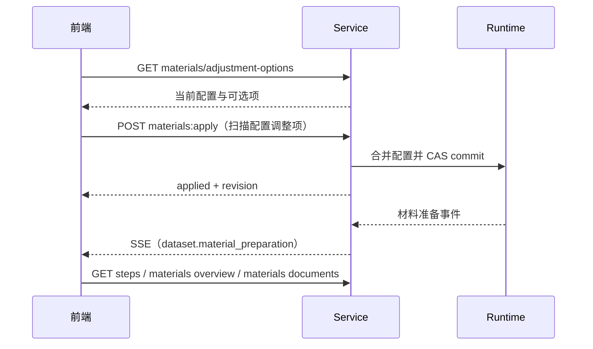
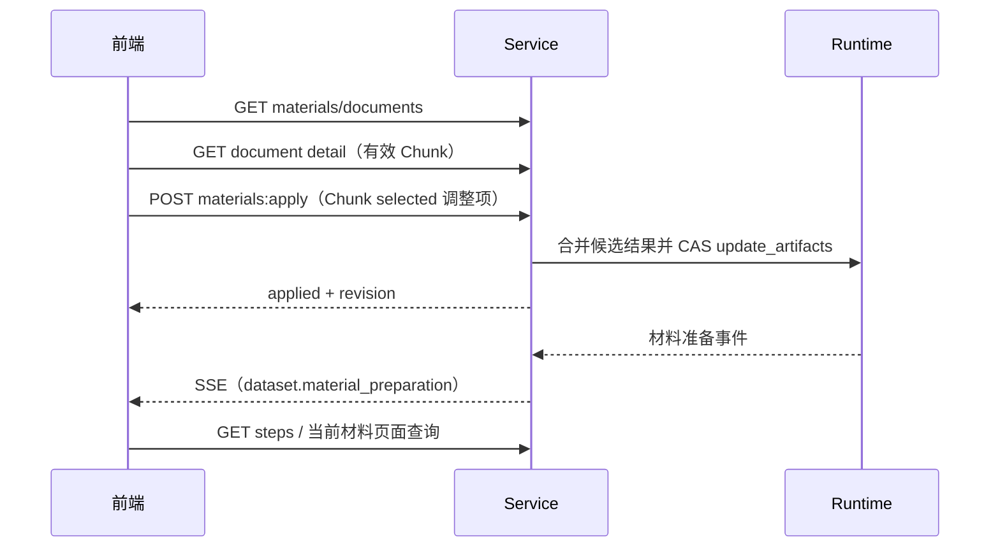

# Dataset 可视化 API 设计

> 需求依据：`/Users/huangsicheng/Downloads/数据集自动构建可视化方案.md`
> 本文只定义接口契约，不包含实现代码。

## 1. 公共约定

### 1.1 路径

本文省略统一的服务或网关前缀。Dataset 接口的 Base Path 为：

```text
/threads/{thread_id}/dataset
```

### 1.2 复用的公共接口

Dataset 页面复用以下 Thread 公共接口，不新增导航和状态推送接口：

| 方法 | URL | 用途 |
| --- | --- | --- |
| `GET` | `/threads/{thread_id}/steps` | 查询执行步骤 |
| `GET` | `/threads/{thread_id}/events:stream` | 接收 Thread 变更通知 |

公共接口的响应示例保持原始结构；响应字段仅说明 Dataset 页面需要使用的部分。

#### 1.2.1 查询执行步骤

```http
GET /threads/{thread_id}/steps
```

##### Path 参数

| 参数 | 类型 | 必填 | 说明 |
| --- | --- | --- | --- |
| `thread_id` | string | 是 | Thread ID |

##### 响应

```json
{
  "thread_id": "thr-12345678",
  "active_step_id": "step-2",
  "items": [
    {
      "thread_id": "thr-12345678",
      "step_id": "step-1",
      "stage": "dataset.material_preparation",
      "title": "dataset.material_preparation",
      "order_index": 0,
      "event_count": 6,
      "next_step_id": "step-2",
      "version": 1,
      "status": "completed",
      "continues_previous": false,
      "active": false
    },
    {
      "thread_id": "thr-12345678",
      "step_id": "step-2",
      "stage": "dataset.topic_discovery",
      "title": "dataset.topic_discovery",
      "order_index": 1,
      "event_count": 2,
      "next_step_id": "",
      "version": null,
      "status": "running",
      "continues_previous": false,
      "active": true
    },
    {
      "thread_id": "thr-12345678",
      "step_id": "step-3",
      "stage": "dataset.case_generation",
      "title": "dataset.case_generation",
      "order_index": 2,
      "event_count": 0,
      "next_step_id": "",
      "version": null,
      "status": "pending",
      "continues_previous": false,
      "active": false
    }
  ],
  "total_size": 3
}
```

##### 响应字段

| 字段 | 类型 | 可空 | 说明 |
| --- | --- | --- | --- |
| `active_step_id` | string | 否 | 当前执行步骤 ID；没有活动步骤时为空字符串 |
| `items[].step_id` | string | 否 | 步骤 ID，用于匹配 `active_step_id` |
| `items[].stage` | string | 否 | Dataset 步骤：`dataset.material_preparation`（材料准备）、`dataset.topic_discovery`（主题发现）、`dataset.case_generation`（用例生成）。 |
| `items[].status` | string | 否 | `pending`（待执行）、`running`（执行中）、`completed`（已完成）、`awaiting_approval`（等待审批）、`failed`（失败）。 |

##### 行为

- 接口固定按材料、主题、用例顺序返回三个步骤；未开始步骤的状态为 `pending`。
- 用户修改数据或主动重跑后，已完成步骤及其后续步骤可能重新进入 `running` 或 `pending`；前端不应按单向完成流程缓存状态。
- 页面首次进入时，根据 `active_step_id` 对应条目的 `stage` 确定默认展示阶段。

##### 错误

| HTTP 状态 | 场景 |
| ---: | --- |
| `403` | 用户无权访问 thread |
| `404` | thread 不存在 |
| `503` | Evo 暂时不可用 |

#### 1.2.2 订阅 Thread 事件

```http
GET /threads/{thread_id}/events:stream
```

##### Path 参数

| 参数 | 类型 | 必填 | 说明 |
| --- | --- | --- | --- |
| `thread_id` | string | 是 | Thread ID |

##### Query 参数

| 参数 | 类型 | 必填 | 说明 |
| --- | --- | --- | --- |
| `step_id` | string | 否 | 按步骤过滤事件。Dataset 页面不传，接收 Thread 的全部事件。 |

##### 请求 Header

| Header | 必填 | 说明 |
| --- | --- | --- |
| `Last-Event-ID` | 否 | 断线重连时从该事件之后继续读取；浏览器 `EventSource` 自动携带。 |

##### 响应

```text
id: event-123
event: dataset.generate_case
data: {
data:   "stage": "dataset.case_generation"
data: }

id: event-456
event: done
data: {}
```

##### 响应字段

| 字段 | 类型 | 可空 | 说明 |
| --- | --- | --- | --- |
| SSE `id` | string | 否 | 不透明事件 ID；前端断线重连时由浏览器作为 `Last-Event-ID` 回传。 |
| SSE `event` | string | 否 | Dataset 事件包括 `dataset.select_docs`、`dataset.load_corpus`、`dataset.build_snapshot`、`dataset.prepare_case`、`dataset.generate_case`、`artifact.committed`、`step.finish`；`done` 表示本轮运行结束。 |
| `data.stage` | string | 是 | 普通事件所属的 Flow Stage：`dataset.material_preparation`、`dataset.topic_discovery` 或 `dataset.case_generation`。Dataset 前端据此判断要刷新的页面。 |

##### 行为

| 事件或 `data.stage` | 前端处理 |
| --- | --- |
| `dataset.material_preparation` | 刷新 `/steps` 和当前材料查询接口。 |
| `dataset.topic_discovery` | 刷新 `/steps` 和当前主题查询接口。 |
| `dataset.case_generation` | 刷新 `/steps` 和当前用例查询接口。 |
| `done` | 刷新 `/steps` 和当前可见的 Dataset 查询接口，然后结束本轮订阅。 |

##### 错误

| HTTP 状态 | 场景 |
| ---: | --- |
| `403` | 用户无权访问 thread |
| `404` | thread 不存在 |
| `503` | Evo 暂时不可用或事件流中断 |

### 1.3 Dataset 接口约定

#### 通用字段

| 名称 | 数据类型 | 说明 | 适用范围 |
| --- | --- | --- | --- |
| `status` | string | Runtime/Flow 当前状态：`pending`、`running`、`completed`、`awaiting_approval`、`failed`。 | 执行步骤：<br>&nbsp;&nbsp;`steps`<br>材料准备：<br>&nbsp;&nbsp;`materials/overview`<br>主题发现：<br>&nbsp;&nbsp;`topics/overview`<br>用例生成：<br>&nbsp;&nbsp;`cases/overview`<br>&nbsp;&nbsp;`cases` 的状态字段与筛选参数<br>&nbsp;&nbsp;`cases/{case_id}` 的阶段状态 |
| `Revision` | string | 不透明版本标识；前端从查询响应取得，并在修改时作为 `expected_revision` 原样传回。 | 材料准备：<br>&nbsp;&nbsp;`materials/overview`<br>&nbsp;&nbsp;`materials/documents`<br>&nbsp;&nbsp;`materials/knowledge-bases/{knowledge_base_id}/documents/{document_id}`<br>&nbsp;&nbsp;`materials/adjustment-options`<br>&nbsp;&nbsp;`materials:apply`<br>主题发现：<br>&nbsp;&nbsp;`topics/overview`、`topics`、`topics/{topic_id}`<br>&nbsp;&nbsp;`topics:apply`<br>用例生成：<br>&nbsp;&nbsp;`cases/overview`、`cases/{case_id}`<br>&nbsp;&nbsp;`generation-plan:apply`、`cases/{case_id}` |
| `PageToken` | string | 不透明分页游标；前端从查询响应取得，并在查询下一页时原样传回。 | 材料准备：<br>&nbsp;&nbsp;`materials/documents`<br>&nbsp;&nbsp;`materials/knowledge-bases/{knowledge_base_id}/documents/{document_id}`<br>主题发现：<br>&nbsp;&nbsp;`topics`<br>&nbsp;&nbsp;`topics/{topic_id}`<br>用例生成：<br>&nbsp;&nbsp;`cases`<br>&nbsp;&nbsp;`cases/{case_id}/topic-options` |

响应字段表中的 `**` 表示该字段已纳入接口契约，但当前 Artifact 或后端代码尚未提供。


#### 分页

适用接口：文档列表、文档详情中的片段列表、主题列表、主题详情中的片段列表、用例列表、可替换主题列表。

这些列表接口统一使用：

| 参数 | 类型 | 必填 | 说明 |
| --- | --- | --- | --- |
| `page_size` | integer | 否 | 每页数量，默认 `50`，范围 `1–200` |
| `page_token` | PageToken | 否 | 下一页标识，首页不传 |

分页响应统一包含：

```json
{
  "items": [],
  "next_page_token": ""
}
```

分页规则：

- 首页不传 `page_token`，也不需要单独传 `revision`。
- `next_page_token` 是不透明游标，绑定首次查询的数据版本、筛选条件、`page_size` 和下一页位置；前端只原样回传，不得解析。
- 携带 `page_token` 请求后续页时，查询条件和 `page_size` 必须与首页一致；不一致或 token 无效时返回 `400`。
- token 绑定的数据版本已不可查询时返回 `409`；前端应从首页重新查询。
- 不允许拼接不同数据版本的页面结果。

#### 修改请求

适用接口：应用材料修改、应用主题名称修改、应用生成计划修改、保存单个用例。

这些修改接口统一包含：

```json
{
  "request_id": "req-123",
  "expected_revision": "revision-token"
}
```

| 字段 | 类型 | 必填 | 说明 |
| --- | --- | --- | --- |
| `request_id` | string | 是 | 幂等请求标识；同一操作重试时保持不变 |
| `expected_revision` | Revision | 是 | 查询接口返回的当前版本 |

修改流程：

```text
收到修改请求
  |
  v
根据请求内容生成指纹
  |
  v
request_id 是否已存在？
  |-- 是 --> 请求指纹是否相同？
  |             |-- 是 --> 返回首次执行结果
  |             `-- 否 --> 返回 409 幂等冲突
  |
  `-- 否 --> expected_revision 是否为当前版本？
                |-- 否 --> 返回 409 版本冲突
                `-- 是 --> 原子应用修改并记录执行结果
                              |-- 返回 applied 和新 revision
                              `-- 下游 Artifact 失效并触发重新执行
```

前端每次提交新操作时生成新的 `request_id`；同一操作的网络重试复用原 ID。

成功响应：

```json
{
  "request_id": "req-123",
  "status": "applied",
  "revision": "new-revision-token"
}
```

#### 错误

| HTTP 状态 | 说明 |
| ---: | --- |
| `400` | 请求格式错误 |
| `403` | 无访问或修改权限 |
| `404` | thread 或业务对象不存在 |
| `409` | revision 冲突、幂等冲突或当前状态不允许修改 |
| `422` | 业务校验失败 |
| `503` | Evo 或依赖服务暂时不可用 |

普通错误响应：

```json
{
  "detail": "revision conflict"
}
```

参数或字段校验错误响应：

```json
{
  "detail": [
    {
      "loc": ["body", "changes", "example"],
      "msg": "invalid value",
      "type": "value_error"
    }
  ]
}
```

## 2. 接口索引

| 状态 | 方法 | URL | 功能 |
| --- | --- | --- | --- |
| 已确认 | `GET` | `/threads/{thread_id}/dataset/materials/overview` | 查询材料概览 |
| 已确认 | `GET` | `/threads/{thread_id}/dataset/materials/documents` | 查询文档列表 |
| 已确认 | `GET` | `/threads/{thread_id}/dataset/materials/knowledge-bases/{knowledge_base_id}/documents/{document_id}` | 查询文档详情及有效片段 |
| 已确认 | `GET` | `/threads/{thread_id}/dataset/materials/adjustment-options` | 查询材料调整选项 |
| 已确认 | `POST` | `/threads/{thread_id}/dataset/materials:apply` | 应用材料修改 |
| 已确认 | `GET` | `/threads/{thread_id}/dataset/topics/overview` | 查询主题概览 |
| 已确认 | `GET` | `/threads/{thread_id}/dataset/topics` | 查询主题列表 |
| 已确认 | `GET` | `/threads/{thread_id}/dataset/topics/{topic_id}` | 查询主题详情 |
| 已确认 | `POST` | `/threads/{thread_id}/dataset/topics:apply` | 应用主题名称修改 |
| 已确认 | `GET` | `/threads/{thread_id}/dataset/cases/overview` | 查询用例生成概览 |
| 已确认 | `GET` | `/threads/{thread_id}/dataset/cases` | 查询用例列表 |
| 已确认 | `GET` | `/threads/{thread_id}/dataset/cases/{case_id}` | 查询用例详情 |
| 已确认 | `GET` | `/threads/{thread_id}/dataset/cases/{case_id}/topic-options` | 查询可替换主题 |
| 已确认 | `POST` | `/threads/{thread_id}/dataset/generation-plan:apply` | 应用生成计划 |
| 已确认 | `PATCH` | `/threads/{thread_id}/dataset/cases/{case_id}` | 保存单个用例 |

## 3. 材料准备

### 3.1 查询材料概览

```http
GET /threads/{thread_id}/dataset/materials/overview
```

#### Path 参数

| 参数 | 类型 | 必填 | 说明 |
| --- | --- | --- | --- |
| `thread_id` | string | 是 | Evo thread ID |

#### 响应

```json
{
  "thread_id": "thr-12345678",
  "revision": "materials-v4",
  "status": "completed",
  "case_plan": {
    "target": 100,
    "imported": 20,
    "automatic": 80
  },
  "chunks": {
    "scanned": 800,
    "effective": 600,
    "selected": 240,
    "effective_rate": 0.75,
    "selection_rate": 0.4
  },
  "warnings": []
}
```

#### 响应字段

| 字段 | 类型 | 可空 | 标记 | 说明 |
| --- | --- | --- | --- | --- |
| `thread_id` | string | 否 |  | Evo thread ID |
| `revision` | Revision | 是 |  | 当前稳定快照的版本；尚无稳定结果时为 `null` |
| `status` | string | 否 | ** | 当前材料构建状态，不表示 `revision` 对应快照的历史状态 |
| `case_plan.target` | integer | 是 |  | 目标用例数 |
| `case_plan.imported` | integer | 是 |  | CSV 导入用例数 |
| `case_plan.automatic` | integer | 是 |  | 自动生成用例数 |
| `chunks.scanned` | integer | 是 |  | 扫描片段数 |
| `chunks.effective` | integer | 是 |  | 有效片段数 |
| `chunks.selected` | integer | 是 |  | 入选片段数 |
| `chunks.effective_rate` | number | 是 | ** | `effective / scanned`；分母为 `0` 时为 `null` |
| `chunks.selection_rate` | number | 是 | ** | `selected / effective`；分母为 `0` 时为 `null` |
| `warnings` | string[] | 否 |  | 当前稳定快照的非阻断性提示 |

#### 行为

- `case_plan` 和 `chunks` 尚无稳定结果时，对象内字段返回 `null`，不使用 `0` 表示未知。
- `revision`、`case_plan`、`chunks` 和 `warnings` 属于同一稳定快照，并整体替换。
- 扫描配置重新构建期间，继续返回上一份稳定快照及其 `revision`；新构建完成后再原子切换。

#### 警告

- `warnings` 不阻断当前稳定快照的返回和下游执行。
- 容量不足表示入选片段数未达到候选目标，可能降低后续主题覆盖度，并可能导致生成规划因可用主题不足而失败；用户可通过调整材料消除提示。

#### 错误

| HTTP 状态 | 场景 |
| ---: | --- |
| `404` | thread 不存在 |
| `403` | 用户无权访问 thread |
| `503` | Evo 暂时不可用 |

### 3.2 查询文档列表

```http
GET /threads/{thread_id}/dataset/materials/documents
```

#### Path 参数

| 参数 | 类型 | 必填 | 说明 |
| --- | --- | --- | --- |
| `thread_id` | string | 是 | Evo thread ID |

#### Query 参数

| 参数 | 类型 | 必填 | 说明 |
| --- | --- | --- | --- |
| `page_size` | integer | 否 | 每页数量，默认 `50`，范围 `1–200` |
| `page_token` | PageToken | 否 | 下一页标识 |
| `included` | boolean | 否 | 按是否参与本次 Dataset 筛选 |
| `knowledge_base_id` | string | 否 | 按知识库筛选 |

#### 响应

```json
{
  "thread_id": "thr-12345678",
  "revision": "materials-v4",
  "items": [
    {
      "document_id": "doc-1",
      "name": "产品手册.pdf",
      "included": true,
      "knowledge_base": {
        "id": "kb-1",
        "name": "产品知识库"
      },
      "chunks": {
        "effective": 60,
        "selected": 24,
        "selection_rate": 0.4
      }
    }
  ],
  "next_page_token": ""
}
```

#### 响应字段

| 字段 | 类型 | 可空 | 标记 | 说明 |
| --- | --- | --- | --- | --- |
| `thread_id` | string | 否 |  | Evo thread ID |
| `revision` | Revision | 是 |  | 当前文档列表稳定快照的版本；尚无稳定结果时为 `null` |
| `items[].document_id` | string | 否 |  | 文档 ID |
| `items[].name` | string | 否 |  | 文档名称 |
| `items[].included` | boolean | 否 |  | 综合知识库与文档选择后的最终生效状态；用户可通过调整材料修改 |
| `items[].knowledge_base.id` | string | 否 |  | 知识库 ID |
| `items[].knowledge_base.name` | string | 否 | ** | 知识库名称 |
| `items[].chunks` | object | 是 |  | 未入选或尚无片段统计时为 `null` |
| `items[].chunks.effective` | integer | 否 |  | 有效片段数 |
| `items[].chunks.selected` | integer | 否 |  | 入选片段数 |
| `items[].chunks.selection_rate` | number | 是 | ** | `selected / effective`；分母为 `0` 时为 `null` |
| `next_page_token` | PageToken | 否 |  | 下一页标识；无下一页时为空字符串 |

#### 行为

- 返回当前稳定快照中发现的全部文档，包括已入选和已排除的文档。
- `included` 仅表示文档是否入选本次 Dataset 构建，不表示文档是否存在或是否已成功导入知识库。
- 知识库被排除时，其下所有文档的 `included` 均为 `false`；前端不再组合知识库和文档状态。
- 未入选或尚未产生片段统计的文档返回 `chunks: null`。
- 文档以 `(knowledge_base.id, document_id)` 作为复合唯一标识；前端不得仅使用 `document_id` 定位文档。
- 多个筛选条件之间为 AND 关系。
- 列表保持知识库和文档的稳定发现顺序。
- 扫描配置重新构建期间继续返回上一份稳定文档快照及其 `revision`；分页 token 与该快照绑定。
- `**` 当前 Artifact 分开保存入选和排除文档，无法恢复两者的原始交错顺序；代码侧需为所有发现文档保留统一的顺序标识。

#### 错误

| HTTP 状态 | 场景 |
| ---: | --- |
| `400` | 分页或筛选参数格式错误 |
| `403` | 用户无权访问 thread |
| `404` | thread 不存在 |
| `409` | `page_token` 对应的分页快照已失效 |
| `503` | Evo 或知识库服务暂时不可用 |

### 3.3 查询文档详情

```http
GET /threads/{thread_id}/dataset/materials/knowledge-bases/{knowledge_base_id}/documents/{document_id}
```

#### Path 参数

| 参数 | 类型 | 必填 | 说明 |
| --- | --- | --- | --- |
| `thread_id` | string | 是 | Evo thread ID |
| `knowledge_base_id` | string | 是 | 知识库 ID |
| `document_id` | string | 是 | 文档 ID |

#### Query 参数

| 参数 | 类型 | 必填 | 说明 |
| --- | --- | --- | --- |
| `page_size` | integer | 否 | 片段每页数量，默认 `50`，范围 `1–200` |
| `page_token` | PageToken | 否 | 片段下一页标识 |
| `selected` | boolean | 否 | 按当前入选状态筛选片段 |
| `split_rule` | string | 否 | 按切分规则筛选片段 |

#### 响应

```json
{
  "thread_id": "thr-12345678",
  "revision": "materials-v4",
  "document": {
    "id": "doc-1",
    "name": "产品手册.pdf",
    "included": true,
    "knowledge_base": {
      "id": "kb-1",
      "name": "产品知识库"
    }
  },
  "chunk_summary": {
    "effective": 60,
    "selected": 24
  },
  "quotas": [
    {
      "split_rule": "block",
      "required": 12,
      "selected": 12
    }
  ],
  "chunks": {
    "items": [
      {
        "chunk_id": "chunk-1",
        "split_rule": "block",
        "layout_type": "paragraph",
        "text": "片段正文",
        "selected": true
      }
    ],
    "next_page_token": ""
  }
}
```

#### 响应字段

| 字段 | 类型 | 可空 | 标记 | 说明 |
| --- | --- | --- | --- | --- |
| `thread_id` | string | 否 |  | Evo thread ID |
| `revision` | Revision | 是 |  | 当前材料版本；尚无结果时为 `null` |
| `document.id` | string | 否 |  | 文档 ID |
| `document.name` | string | 否 |  | 文档名称 |
| `document.included` | boolean | 否 |  | 综合知识库与文档选择后的最终生效状态 |
| `document.knowledge_base.id` | string | 否 |  | 知识库 ID |
| `document.knowledge_base.name` | string | 否 | ** | 知识库名称 |
| `chunk_summary` | object | 是 |  | 未参与或尚无片段统计时为 `null` |
| `chunk_summary.effective` | integer | 否 |  | 有效片段数 |
| `chunk_summary.selected` | integer | 否 |  | 入选片段数 |
| `quotas` | array | 否 |  | 各切分规则配额；未参与时为空数组 |
| `quotas[].split_rule` | string | 否 |  | 切分规则标识 |
| `quotas[].required` | integer | 否 | ** | 要求入选的精确数量 |
| `quotas[].selected` | integer | 否 |  | 当前实际入选数量 |
| `chunks.items` | array | 否 | ** | 当前文档的全部有效片段，包括已入选和未入选片段 |
| `chunks.items[].chunk_id` | string | 否 |  | 片段 ID |
| `chunks.items[].split_rule` | string | 否 |  | 切分规则标识 |
| `chunks.items[].layout_type` | string | 否 |  | 版面类型 |
| `chunks.items[].text` | string | 否 |  | 片段正文 |
| `chunks.items[].selected` | boolean | 否 | ** | 当前入选状态；用户可修改，且不影响片段有效性 |
| `chunks.next_page_token` | PageToken | 否 |  | 片段下一页标识；无下一页时为空字符串 |

#### 行为

- 未参与本次 Dataset 的文档返回 `chunk_summary: null`、`quotas: []` 和空的 `chunks.items`。
- `quotas[].required` 是当前材料版本冻结的配额，不随前端草稿变化。
- 每个切分规则使用精确配额；用户调整后的入选数量必须等于 `required`，只能替换，不能额外增加或减少。
- `required` 根据当前有效片段分配，不超过同一文档、同一切分规则的有效片段数；稳定快照始终满足 `selected == required`。
- 前端根据草稿入选数量和 `required` 即时提示是否满足配额；最终结果由应用材料修改接口重新校验。
- 不传 `selected` 时返回全部有效片段，包括已入选和未入选片段。
- 文档详情中的片段调整只修改入选状态，不改变片段有效性，也不重新执行扫描。
- 只有“调整材料”改变扫描范围或有效性规则时，才重新执行扫描并产生新的有效片段快照。
- 扫描配置重新构建期间，详情继续返回上一份稳定片段快照；此时不允许提交 `chunk_selection_changes`。
- 多个片段筛选条件之间为 AND 关系。
- 片段列表顺序在同一 `revision` 内保持稳定。
- `**` 当前 `build_chunk_candidates` 将有效性扫描与入选状态耦合，且未保留全部有效片段；代码侧需保留完整有效片段 Artifact，并通过 Artifact 修改接口直接更新入选状态，仅使下游 Artifact 失效。

#### 错误

| HTTP 状态 | 场景 |
| ---: | --- |
| `400` | 片段分页或筛选参数格式错误 |
| `403` | 用户无权访问 thread |
| `404` | thread、知识库或文档不存在 |
| `409` | `page_token` 对应的分页快照已失效 |
| `503` | Evo 或知识库服务暂时不可用 |

### 3.4 查询材料调整选项

```http
GET /threads/{thread_id}/dataset/materials/adjustment-options
```

#### Path 参数

| 参数 | 类型 | 必填 | 说明 |
| --- | --- | --- | --- |
| `thread_id` | string | 是 | Evo thread ID |

#### 响应

```json
{
  "thread_id": "thr-12345678",
  "revision": "materials-v4",
  "target_case_count": 100,
  "knowledge_bases": [
    {
      "id": "kb-1",
      "name": "产品知识库",
      "included": true
    }
  ],
  "split_rules": [
    {
      "id": "block",
      "name": "Block",
      "supported": true,
      "enabled": true,
      "priority": 1
    }
  ],
  "layout_types": [
    {
      "id": "paragraph",
      "name": "段落",
      "supported": true,
      "enabled": true
    }
  ]
}
```

#### 响应字段

| 字段 | 类型 | 可空 | 标记 | 说明 |
| --- | --- | --- | --- | --- |
| `thread_id` | string | 否 |  | Evo thread ID |
| `revision` | Revision | 否 |  | 当前材料配置版本 |
| `target_case_count` | integer | 否 |  | 当前目标用例数 |
| `knowledge_bases` | array | 否 | ** | 当前用户可访问的全部知识库；由 Core 按用户身份和 ACL 过滤 |
| `knowledge_bases[].id` | string | 否 |  | 知识库 ID |
| `knowledge_bases[].name` | string | 否 | ** | 知识库名称 |
| `knowledge_bases[].included` | boolean | 否 |  | 是否启用该知识库作为材料来源，不表示其下全部文档均已入选 |
| `split_rules` | array | 否 | ** | 标准切分规则目录；由当前可用材料来源的解析算法能力投影 |
| `split_rules[].id` | string | 否 |  | 切分规则标识 |
| `split_rules[].name` | string | 否 | ** | 展示名称 |
| `split_rules[].supported` | boolean | 否 | ** | 当前材料来源组合是否支持该规则；`false` 时不得设为启用 |
| `split_rules[].enabled` | boolean | 否 |  | 是否启用 |
| `split_rules[].priority` | integer | 是 |  | 启用规则的优先级，从 `1` 开始；未启用时为 `null` |
| `layout_types` | array | 否 | ** | 平台标准版面类型完整目录；无论是否启用 OCR 或使用何种 Reader，均返回相同的稳定 ID 与展示名称 |
| `layout_types[].id` | string | 否 |  | 版面类型标识 |
| `layout_types[].name` | string | 否 | ** | 展示名称 |
| `layout_types[].supported` | boolean | 否 | ** | 当前材料来源的解析链路能否可靠产出该标准类型；不表示其已获准参与数据集生成 |
| `layout_types[].enabled` | boolean | 否 |  | 是否启用 |

#### 错误

| HTTP 状态 | 场景 |
| ---: | --- |
| `403` | 用户无权访问 thread |
| `404` | thread 不存在 |
| `503` | Evo 或知识库服务暂时不可用 |

### 3.5 应用材料修改

```http
POST /threads/{thread_id}/dataset/materials:apply
```

#### Path 参数

| 参数 | 类型 | 必填 | 说明 |
| --- | --- | --- | --- |
| `thread_id` | string | 是 | Evo thread ID |

#### 请求：调整扫描配置

```json
{
  "request_id": "req-123",
  "expected_revision": "materials-v4",
  "changes": {
    "target_case_count": 120,
    "knowledge_bases": [
      {
        "id": "kb-2",
        "included": true
      }
    ],
    "documents": [
      {
        "knowledge_base_id": "kb-1",
        "document_id": "doc-3",
        "included": false
      }
    ],
    "split_rule_ids": [
      "block",
      "sentence"
    ],
    "layout_type_ids": [
      "paragraph",
      "table"
    ]
  }
}
```

#### 请求：调整片段入选

```json
{
  "request_id": "req-456",
  "expected_revision": "materials-v4",
  "changes": {
    "chunk_selection_changes": [
      {
        "knowledge_base_id": "kb-1",
        "document_id": "doc-1",
        "chunk_id": "chunk-1",
        "selected": false
      },
      {
        "knowledge_base_id": "kb-1",
        "document_id": "doc-1",
        "chunk_id": "chunk-5",
        "selected": true
      }
    ]
  }
}
```

#### 请求字段：调整扫描配置

| 字段 | 类型 | 必填 | 说明 |
| --- | --- | --- | --- |
| `request_id` | string | 是 | 幂等请求标识 |
| `expected_revision` | Revision | 是 | 材料调整选项接口返回的当前配置版本 |
| `changes` | object | 是 | 仅提交发生变化的扫描配置项；至少包含一项。Service 与当前完整配置合并后，原子覆盖写入完整配置 Artifact。 |
| `changes.target_case_count` | integer | 否 | 新目标用例数 |
| `changes.knowledge_bases` | array | 否 | 参与状态发生变化的知识库 |
| `changes.knowledge_bases[].id` | string | 是 | 知识库 ID |
| `changes.knowledge_bases[].included` | boolean | 是 | 新参与状态 |
| `changes.documents` | array | 否 | 参与状态发生变化的文档 |
| `changes.documents[].knowledge_base_id` | string | 是 | 知识库 ID |
| `changes.documents[].document_id` | string | 是 | 文档 ID |
| `changes.documents[].included` | boolean | 是 | 新参与状态 |
| `changes.split_rule_ids` | string[] | 否 | 新的完整启用列表；数组顺序表示优先级 |
| `changes.layout_type_ids` | string[] | 否 | 新的完整启用列表 |

#### 请求字段：调整片段入选

| 字段 | 类型 | 必填 | 说明 |
| --- | --- | --- | --- |
| `request_id` | string | 是 | 幂等请求标识 |
| `expected_revision` | Revision | 是 | 文档详情接口返回的当前稳定片段快照版本 |
| `changes` | object | 是 | 仅提交 `selected` 发生变化的有效 Chunk；只能包含 `chunk_selection_changes`。Service 合并修改、校验完整候选结果后，原子写回完整候选 Artifact。 |
| `changes.chunk_selection_changes` | array | 是 | 至少一项 Chunk 入围状态调整 |
| `changes.chunk_selection_changes[].knowledge_base_id` | string | 是 | 知识库 ID |
| `changes.chunk_selection_changes[].document_id` | string | 是 | 文档 ID |
| `changes.chunk_selection_changes[].chunk_id` | string | 是 | 有效 Chunk ID |
| `changes.chunk_selection_changes[].selected` | boolean | 是 | 修改后的入围状态 |

#### 成功响应

```json
{
  "request_id": "req-123",
  "status": "applied",
  "revision": "materials-v5"
}
```

#### 校验

| 对象 | 规则 |
| --- | --- |
| `target_case_count` | 正整数 |
| 知识库 | 存在且用户有权访问；ID 不重复 |
| 文档 | 存在且属于指定知识库；复合 ID 不重复 |
| `split_rule_ids` | 非空、无重复、均为允许值 |
| `layout_type_ids` | 非空、无重复、均为允许值 |
| `chunk_selection_changes` | 复合 Chunk ID 不重复；Chunk 存在、有效且属于指定文档。Service 合并调整后，按切分规则分组的入选数量必须等于当前稳定快照中的 `required` |
| 组合修改 | `chunk_selection_changes` 不得与扫描配置字段同时出现 |
| revision | 扫描配置修改时必须与当前配置版本一致；片段入选修改时必须与当前稳定片段快照版本一致，且当前不得有扫描配置重建 |

#### 行为

调整扫描配置：



调整片段入选：



#### 错误

| HTTP 状态 | 场景 |
| ---: | --- |
| `400` | 请求格式错误 |
| `403` | 用户无修改权限或无权访问知识库 |
| `404` | thread、知识库、文档或片段不存在 |
| `409` | revision 冲突或幂等冲突 |
| `422` | 材料配置或片段配额校验失败 |
| `503` | Evo 或知识库服务暂时不可用 |

## 4. 主题发现

### 4.1 查询主题概览

```http
GET /threads/{thread_id}/dataset/topics/overview
```

#### Path 参数

| 参数 | 类型 | 必填 | 说明 |
| --- | --- | --- | --- |
| `thread_id` | string | 是 | Evo thread ID |

#### 响应

```json
{
  "thread_id": "thr-12345678",
  "revision": "topics-v3",
  "status": "completed",
  "total_topics": 30,
  "question_types": {
    "precision": {
      "count": 18,
      "rate": 0.6
    },
    "reasoning": {
      "count": 12,
      "rate": 0.4
    }
  }
}
```

#### 响应字段

| 字段 | 类型 | 可空 | 标记 | 说明 |
| --- | --- | --- | --- | --- |
| `thread_id` | string | 否 |  | Evo thread ID |
| `revision` | Revision | 是 |  | 当前主题稳定快照的版本；尚无稳定结果时为 `null` |
| `status` | string | 否 | ** | 主题发现阶段当前构建状态 |
| `total_topics` | integer | 是 |  | 主题总数；尚无稳定结果时为 `null` |
| `question_types.precision.count` | integer | 是 |  | 准确型主题数；尚无稳定结果时为 `null` |
| `question_types.precision.rate` | number | 是 | ** | 准确型主题占比；总数为 `0` 或尚无稳定结果时为 `null` |
| `question_types.reasoning.count` | integer | 是 |  | 推理型主题数；尚无稳定结果时为 `null` |
| `question_types.reasoning.rate` | number | 是 | ** | 推理型主题占比；总数为 `0` 或尚无稳定结果时为 `null` |

#### 行为

- 内部 `entity` 类型映射为 `precision`，`embedding` 类型映射为 `reasoning`；前端只使用产品题型。
- 题型统计单位是展开后的主题数，不是 Cluster 数；同一 Cluster 中的多个主题分别计数。
- `status: completed` 且 `total_topics: 0` 是合法空结果，此时两个题型的 `count` 为 `0`、`rate` 为 `null`；尚无稳定结果时数量字段为 `null`。
- `revision`、`total_topics` 和 `question_types` 属于同一稳定快照，并整体替换。

#### 错误

| HTTP 状态 | 场景 |
| ---: | --- |
| `403` | 用户无权访问 thread |
| `404` | thread 不存在 |
| `503` | Evo 暂时不可用 |

### 4.2 查询主题列表

```http
GET /threads/{thread_id}/dataset/topics
```

#### Path 参数

| 参数 | 类型 | 必填 | 说明 |
| --- | --- | --- | --- |
| `thread_id` | string | 是 | Evo thread ID |

#### Query 参数

| 参数 | 类型 | 必填 | 说明 |
| --- | --- | --- | --- |
| `page_size` | integer | 否 | 每页数量，默认 `50`，范围 `1–200` |
| `page_token` | PageToken | 否 | 下一页标识 |
| `question_type` | string | 否 | 按适用题型精确筛选：`precision` 或 `reasoning` |
| `min_chunk_count` | integer | 否 | 最小支撑片段数，包含下界 |
| `max_chunk_count` | integer | 否 | 最大支撑片段数，包含上界 |

#### 响应

```json
{
  "thread_id": "thr-12345678",
  "revision": "topics-v3",
  "items": [
    {
      "topic_id": "topic-001",
      "name": "新能源汽车补能方式",
      "question_type": "precision",
      "chunk_count": 8
    }
  ],
  "next_page_token": ""
}
```

#### 响应字段

| 字段 | 类型 | 可空 | 标记 | 说明 |
| --- | --- | --- | --- | --- |
| `thread_id` | string | 否 |  | Evo thread ID |
| `revision` | Revision | 是 |  | 当前主题集合版本；尚未产生主题结果时为 `null` |
| `items[].topic_id` | string | 否 | ** | 主题稳定业务主键 |
| `items[].name` | string | 否 |  | 主题名称 |
| `items[].question_type` | string | 否 |  | 适用题型：`precision` 或 `reasoning` |
| `items[].chunk_count` | integer | 否 |  | 支撑当前主题的片段数量 |
| `next_page_token` | PageToken | 否 |  | 下一页标识；无下一页时为空字符串 |

#### 行为

- 主题发现一次性生成完整 Manifest，不提供单主题执行状态；阶段状态由主题概览接口统一提供。
- 多个筛选条件之间为 AND 关系；`min_chunk_count` 大于 `max_chunk_count` 时返回 `400`。
- 固定按主题发现结果中的稳定顺序返回；筛选和重命名不改变相对顺序。
- `topic_id` 在当前主题集合 revision 内稳定；主题重命名及所有后续阶段均保持原 ID。主题发现重新执行产生新结果后整体覆盖当前集合，跨 revision 不保证 ID 延续或不复用。
- 首次主题发现尚无结果时返回 `revision: null`、空 `items` 和空 `next_page_token`。
- 已有旧结果并正在重新执行时继续返回旧 revision 的完整列表；新 Manifest 产生后原子切换到新 revision 和新列表。
- `**` 当前 Artifact 以 Cluster 和主题名称数组组织；算法侧后续需改为以 `topic_id` 标识的独立主题对象。

#### 错误

| HTTP 状态 | 场景 |
| ---: | --- |
| `400` | 分页或筛选参数无效 |
| `403` | 用户无权访问 thread |
| `404` | thread 不存在 |
| `409` | `page_token` 对应的分页快照已失效 |
| `503` | Evo 暂时不可用 |

### 4.3 查询主题详情

```http
GET /threads/{thread_id}/dataset/topics/{topic_id}
```

#### Path 参数

| 参数 | 类型 | 必填 | 说明 |
| --- | --- | --- | --- |
| `thread_id` | string | 是 | Evo thread ID |
| `topic_id` | string | 是 | 主题 ID；当前 Artifact 尚未提供 |

#### Query 参数

| 参数 | 类型 | 必填 | 说明 |
| --- | --- | --- | --- |
| `page_size` | integer | 否 | 支撑片段每页数量，默认 `50`，范围 `1–200` |
| `page_token` | PageToken | 否 | 支撑片段下一页标识 |

#### 响应

```json
{
  "thread_id": "thr-12345678",
  "revision": "topics-v3",
  "topic": {
    "topic_id": "topic-001",
    "name": "新能源汽车补能方式",
    "question_type": "precision",
    "chunk_count": 83
  },
  "chunks": {
    "items": [
      {
        "chunk_id": "chunk-1",
        "knowledge_base": {
          "id": "kb-1",
          "name": "产品知识库"
        },
        "document": {
          "id": "doc-1",
          "name": "产品手册.pdf"
        },
        "split_rule": "block",
        "layout_type": "paragraph",
        "text": "片段正文"
      }
    ],
    "next_page_token": ""
  }
}
```

#### 响应字段

| 字段 | 类型 | 可空 | 标记 | 说明 |
| --- | --- | --- | --- | --- |
| `thread_id` | string | 否 |  | Evo thread ID |
| `revision` | Revision | 否 |  | 当前主题集合版本 |
| `topic.topic_id` | string | 否 | ** | 主题稳定业务主键 |
| `topic.name` | string | 否 |  | 主题名称 |
| `topic.question_type` | string | 否 |  | 适用题型：`precision` 或 `reasoning` |
| `topic.chunk_count` | integer | 否 |  | 支撑片段总数 |
| `chunks.items` | array | 否 |  | 当前页的支撑片段 |
| `chunks.items[].chunk_id` | string | 否 |  | 片段 ID |
| `chunks.items[].knowledge_base.id` | string | 否 |  | 知识库 ID |
| `chunks.items[].knowledge_base.name` | string | 否 | ** | 知识库名称 |
| `chunks.items[].document.id` | string | 否 |  | 文档 ID |
| `chunks.items[].document.name` | string | 否 |  | 文档名称 |
| `chunks.items[].split_rule` | string | 否 |  | 切分规则标识 |
| `chunks.items[].layout_type` | string | 否 |  | 版面类型 |
| `chunks.items[].text` | string | 否 |  | 片段正文 |
| `chunks.next_page_token` | PageToken | 否 |  | 支撑片段下一页标识；无下一页时为空字符串 |

#### 行为

- 支撑片段固定按主题结果中的顺序返回，并在同一 `revision` 内保持稳定。
- `topic` 来自当前主题 `revision`；`chunks` 按其 `chunk_ids` 读取当前有效 `dataset.chunk`。上游材料变更会使当前主题结果失效，必须先生成新的主题结果后再提供详情，不提供跨材料版本的 Topic/Chunk 混合结果。
- 主题发现重新执行期间，旧 revision 的主题详情保持可查询；新结果可用后整体切换。

#### 错误

| HTTP 状态 | 场景 |
| ---: | --- |
| `400` | 分页参数无效 |
| `403` | 用户无权访问 thread |
| `404` | thread 或 topic 不存在 |
| `409` | `page_token` 对应的分页快照已失效 |
| `503` | Evo 或知识库服务暂时不可用 |

### 4.4 应用主题名称修改

```http
POST /threads/{thread_id}/dataset/topics:apply
```

#### 请求

```json
{
  "request_id": "req-123",
  "expected_revision": "topics-v3",
  "changes": [
    {
      "topic_id": "topic-001",
      "name": "新能源汽车充电方式"
    },
    {
      "topic_id": "topic-008",
      "name": "动力电池安全标准"
    }
  ]
}
```

#### 请求字段

| 字段 | 类型 | 必填 | 标记 | 说明 |
| --- | --- | --- | --- | --- |
| `request_id` | string | 是 |  | 幂等请求标识 |
| `expected_revision` | Revision | 是 |  | 主题列表接口返回的当前主题集合版本 |
| `changes` | array | 是 |  | 名称发生变化的主题；至少一项 |
| `changes[].topic_id` | string | 是 | ** | 主题 ID；数组内不得重复 |
| `changes[].name` | string | 是 |  | 主题的最终名称 |

#### 成功响应

```json
{
  "request_id": "req-123",
  "status": "applied",
  "revision": "topics-v4"
}
```

#### 校验

| 对象 | 规则 |
| --- | --- |
| `changes` | 至少一项；`topic_id` 不重复 |
| `topic_id` | 存在于 `expected_revision` 对应的主题集合 |
| `name` | string；去除首尾空白后非空；不校验名称唯一性 |
| revision | 必须与当前主题集合版本一致 |

#### 行为

- 整批名称修改原子应用，并产生一个新的主题集合 `revision`。
- 仅主题发现状态为 `completed` 时允许修改；其他状态返回 `409`。下游阶段是否正在执行不影响修改。
- 名称通过 Artifact 修改接口直接更新，不重新执行主题发现，`topic_id` 保持不变；Evo 根据依赖图自动计算并传播下游失效范围。

#### 错误

| HTTP 状态 | 场景 |
| ---: | --- |
| `400` | 请求格式错误 |
| `403` | 用户无修改权限 |
| `404` | thread 或 topic 不存在 |
| `409` | revision 冲突、幂等冲突或当前状态不允许修改 |
| `422` | 主题名称校验失败 |
| `503` | Evo 暂时不可用 |

## 5. 用例生成

`CaseStage` 用于标识 Case 详情的建议定位子步骤（`focus_stage`）：`plan`（生成规划）、`generate`（问答生成）、`grading`（判分规则）。

### 5.1 查询用例生成概览

```http
GET /threads/{thread_id}/dataset/cases/overview
```

#### Path 参数

| 参数 | 类型 | 必填 | 说明 |
| --- | --- | --- | --- |
| `thread_id` | string | 是 | Evo thread ID |

#### 响应

```json
{
  "thread_id": "thr-12345678",
  "revision": "cases-v7",
  "status": "failed",
  "stages": {
    "plan": {
      "status": "completed",
      "completed": 12,
      "total": 12,
      "status_counts": {
        "pending": 0,
        "running": 0,
        "completed": 12,
        "awaiting_approval": 0,
        "failed": 0
      }
    },
    "generate": {
      "status": "failed",
      "completed": 8,
      "total": 12,
      "status_counts": {
        "pending": 1,
        "running": 1,
        "completed": 8,
        "awaiting_approval": 0,
        "failed": 2
      }
    },
    "grading": {
      "status": "pending",
      "completed": 0,
      "total": 12,
      "status_counts": {
        "pending": 12,
        "running": 0,
        "completed": 0,
        "awaiting_approval": 0,
        "failed": 0
      }
    }
  },
  "automatic_plan": {
    "total": 8,
    "question_types": {
      "precision": {
        "total": 5,
        "difficulties": {
          "easy": 2,
          "medium": 2,
          "hard": 1
        }
      },
      "reasoning": {
        "total": 3,
        "difficulties": {
          "easy": 1,
          "medium": 1,
          "hard": 1
        }
      }
    }
  }
}
```

#### 响应字段

| 字段 | 类型 | 可空 | 标记 | 说明 |
| --- | --- | --- | --- | --- |
| `thread_id` | string | 否 |  | Evo thread ID |
| `revision` | Revision | 否 |  | 当前生成计划配置版本 |
| `status` | string | 否 | ** | 用例生成阶段整体状态 |
| `stages.plan` | object | 否 | ** | 生成规划进度 |
| `stages.generate` | object | 否 | ** | 问答生成进度 |
| `stages.grading` | object | 否 | ** | 判分规则进度 |
| `stages.{stage}.status` | string | 否 | ** | 子阶段主状态 |
| `stages.{stage}.completed` | integer | 是 |  | 有效完成用例数 |
| `stages.{stage}.total` | integer | 是 |  | 目标用例总数，包含 CSV 导入和自动生成用例 |
| `stages.{stage}.status_counts.pending` | integer | 是 | ** | 待执行数量 |
| `stages.{stage}.status_counts.running` | integer | 是 | ** | 执行中数量 |
| `stages.{stage}.status_counts.completed` | integer | 是 | ** | 有效完成数量 |
| `stages.{stage}.status_counts.awaiting_approval` | integer | 是 | ** | 等待审批数量 |
| `stages.{stage}.status_counts.failed` | integer | 是 | ** | 失败数量 |
| `automatic_plan.total` | integer | 是 |  | 自动生成用例总数 |
| `automatic_plan.question_types.{type}.total` | integer | 是 |  | 对应题型的自动生成用例数 |
| `automatic_plan.question_types.{type}.difficulties.easy` | integer | 是 |  | 简单用例数 |
| `automatic_plan.question_types.{type}.difficulties.medium` | integer | 是 |  | 中等用例数 |
| `automatic_plan.question_types.{type}.difficulties.hard` | integer | 是 |  | 困难用例数 |

#### 行为

- `plan` 覆盖共享的 `dataset.qaplan_plan` 和分区的 `dataset.qaplan_spec`，`generate` 对应 `dataset.case`，`grading` 对应 `dataset.case_enhance`；三个阶段最终均投影为 Case 维度状态。
- 共享规划节点执行中或失败时，其状态由所有尚未产出当前 `qaplan_spec` 的 Case 继承，确保规划失败不会被显示为“未开始”。
- `revision` 和 `automatic_plan` 表示当前生成计划配置；应用生成计划修改后立即更新，不等待 Case 重新规划完成。
- 材料修改导致自动生成用例总数变化时，旧的整数分布失效；新的生成计划按当前总数重新确定并产生新的 `revision`。
- `stages` 表示当前各 Case partition 的实时状态，其变化不产生新 `revision`。
- 顶层及子阶段 `status` 均按 `failed > running > awaiting_approval > pending > completed` 汇总。
- 子阶段存在 `total` 时，五项 `status_counts` 之和等于 `total`，且 `completed` 等于 `status_counts.completed`。
- 自动生成计划分布不包含 CSV 导入用例；计划已产生时固定返回完整矩阵，真实零值返回 `0`。
- 尚未确定目标、导入和自动生成 Case 分配时，矩阵结构保持不变，所有数量返回 `null`。
- 初次未提交生成计划时，算法按六路 1:1 分配；用户提交后，`distribution` 仅表示该次当前自动生成用例数下的精确整数数量，不携带跨总数变化的比例语义。
- Service 直接使用 Case Snapshot 的 operation 状态与统计，不从事件反推状态。

#### 错误

| HTTP 状态 | 场景 |
| ---: | --- |
| `403` | 用户无权访问 thread |
| `404` | thread 不存在 |
| `503` | Evo 暂时不可用 |

### 5.2 查询用例列表

```http
GET /threads/{thread_id}/dataset/cases
```

#### Path 参数

| 参数 | 类型 | 必填 | 说明 |
| --- | --- | --- | --- |
| `thread_id` | string | 是 | Evo thread ID |

#### Query 参数

| 参数 | 类型 | 必填 | 说明 |
| --- | --- | --- | --- |
| `page_size` | integer | 否 | 每页数量，默认 `50`，范围 `1–200` |
| `page_token` | PageToken | 否 | 下一页标识 |
| `plan_status` | string | 否 | 按生成规划状态筛选；仅接受公共 `status` 枚举。 |
| `generate_status` | string | 否 | 按问答生成状态筛选；仅接受公共 `status` 枚举。 |
| `grading_status` | string | 否 | 按判分规则状态筛选；仅接受公共 `status` 枚举。 |
| `source` | string | 否 | 按用例来源筛选：`imported` 或 `generated` |
| `question_type` | string | 否 | 按题型筛选：`precision` 或 `reasoning` |
| `difficulty` | string | 否 | 按难度筛选：`easy`、`medium` 或 `hard` |

#### 响应

```json
{
  "thread_id": "thr-12345678",
  "items": [
    {
      "case_id": "case_0001",
      "stages": {
        "plan": "completed",
        "generate": "running",
        "grading": "pending"
      },
      "source": "generated",
      "question_type": "precision",
      "difficulty": "medium",
      "topic": {
        "topic_id": "topic-008",
        "name": "动力电池安全标准"
      }
    },
    {
      "case_id": "case_0002",
      "stages": {
        "plan": "completed",
        "generate": "completed",
        "grading": "completed"
      },
      "source": "imported",
      "question_type": "reasoning",
      "difficulty": "hard",
      "topic": null
    }
  ],
  "next_page_token": ""
}
```

#### 响应字段

| 字段 | 类型 | 可空 | 标记 | 说明 |
| --- | --- | --- | --- | --- |
| `thread_id` | string | 否 |  | Evo thread ID |
| `items[].case_id` | string | 否 |  | Evo Case partition ID；前端不得解析其格式 |
| `items[].stages.plan` | string | 否 | ** | 生成规划状态 |
| `items[].stages.generate` | string | 否 | ** | 问答生成状态 |
| `items[].stages.grading` | string | 否 | ** | 判分规则状态 |
| `items[].source` | string | 否 |  | 用例来源：`imported` 或 `generated` |
| `items[].question_type` | string | 是 |  | 题型：`precision` 或 `reasoning`；自动生成用例尚未完成规划时为 `null` |
| `items[].difficulty` | string | 是 |  | 难度：`easy`、`medium` 或 `hard`；自动生成用例尚未完成规划时为 `null` |
| `items[].topic` | object | 是 |  | 当前绑定主题；CSV 导入或自动生成用例尚未完成规划时为 `null` |
| `items[].topic.topic_id` | string | 否 | ** | 主题 ID |
| `items[].topic.name` | string | 否 |  | 主题名称 |
| `next_page_token` | PageToken | 否 |  | 下一页标识；无下一页时为空字符串 |

#### 行为

- 每个筛选参数只接受单值，多个条件之间为 AND；字段值为 `null` 时不匹配对应筛选条件。
- 固定按目标 Case 分配顺序返回。
- 目标 Case 确定后立即返回全部用例；自动生成用例尚未完成规划时，题型、难度和主题为 `null`。
- CSV 导入用例的主题始终为 `null`。
- 存在历史规划结果时，可继续返回其题型、难度和主题；`status` 仍以当前快照为准。
- 状态筛选分页绑定首次查询的 Case 状态快照：Service 基于 `case_snapshot()` 与当前 `PartitionSet` 生成快照签名并写入 page token；后续请求发现签名变化时返回 `409`，避免跨状态快照翻页。

#### 错误

| HTTP 状态 | 场景 |
| ---: | --- |
| `400` | 分页或筛选参数无效 |
| `403` | 用户无权访问 thread |
| `404` | thread 不存在 |
| `409` | `page_token` 对应的分页快照已失效 |
| `503` | Evo 暂时不可用 |

### 5.3 查询用例详情

```http
GET /threads/{thread_id}/dataset/cases/{case_id}
```

#### Path 参数

| 参数 | 类型 | 必填 | 说明 |
| --- | --- | --- | --- |
| `thread_id` | string | 是 | Evo thread ID |
| `case_id` | string | 是 | Case ID |

#### 响应

```json
{
  "thread_id": "thr-12345678",
  "revision": "case_0001-v4",
  "case_id": "case_0001",
  "source": "generated",
  "question_type": "precision",
  "difficulty": "medium",
  "topic": {
    "topic_id": "topic-008",
    "name": "动力电池安全标准",
    "chunk_count": 6
  },
  "focus_stage": "plan",
  "references": [
    {
      "chunk_id": "chunk-1",
      "knowledge_base": {
        "id": "kb-1",
        "name": "产品知识库"
      },
      "document": {
        "id": "doc-1",
        "name": "产品手册.pdf"
      },
      "text": "片段正文"
    },
    {
      "chunk_id": "chunk-2",
      "knowledge_base": {
        "id": "kb-1",
        "name": "产品知识库"
      },
      "document": {
        "id": "doc-2",
        "name": "安全规范.pdf"
      },
      "text": "另一条片段正文"
    }
  ],
  "stages": {
    "plan": {
      "status": "completed"
    },
    "generate": {
      "status": "completed",
      "question": "电池热失控的主要诱因是什么？",
      "answer": "主要诱因包括内部短路等。",
      "grading_guidance": "回答应准确说明主要诱因。"
    },
    "grading": {
      "status": "completed",
      "key_points": [
        {
          "statement": "应指出热失控与内部短路有关",
          "evidence_chunk_ids": [
            "chunk-1"
          ]
        }
      ],
      "forbidden_claims": [
        "电池热失控只可能由外部高温引起"
      ]
    }
  }
}
```

#### 响应字段

| 字段 | 类型 | 可空 | 标记 | 说明 |
| --- | --- | --- | --- | --- |
| `thread_id` | string | 否 |  | Evo thread ID |
| `revision` | Revision | 否 | ** | 当前 Case 版本 |
| `case_id` | string | 否 |  | Case ID |
| `source` | string | 否 |  | 用例来源：`imported` 或 `generated` |
| `question_type` | string | 是 |  | 题型：`precision` 或 `reasoning`；生成规划尚未产出时为 `null` |
| `difficulty` | string | 是 |  | 难度：`easy`、`medium` 或 `hard`；生成规划尚未产出时为 `null` |
| `topic` | object | 是 |  | 当前绑定主题；CSV 导入或生成规划尚未产出时为 `null` |
| `topic.topic_id` | string | 否 | ** | 主题 ID |
| `topic.name` | string | 否 |  | 主题名称 |
| `topic.chunk_count` | integer | 否 |  | 主题支撑片段总数 |
| `focus_stage` | CaseStage | 否 | ** | 建议默认定位的阶段 |
| `references` | array | 否 |  | 当前 Case 实际引用的片段 |
| `references[].chunk_id` | string | 否 |  | 片段 ID |
| `references[].knowledge_base.id` | string | 否 | ** | 知识库 ID |
| `references[].knowledge_base.name` | string | 否 | ** | 知识库名称 |
| `references[].document.id` | string | 否 | ** | 文档 ID |
| `references[].document.name` | string | 否 | ** | 文档名称 |
| `references[].text` | string | 否 |  | 片段正文 |
| `stages.plan.status` | string | 否 | ** | 生成规划状态 |
| `stages.generate.status` | string | 否 | ** | 问答生成状态 |
| `stages.generate.question` | string | 是 |  | 问题；尚未产出时为 `null` |
| `stages.generate.answer` | string | 是 |  | 标准答案；尚未产出时为 `null` |
| `stages.generate.grading_guidance` | string | 是 |  | 评分说明；尚未产出时为 `null` |
| `stages.grading.status` | string | 否 | ** | 判分规则状态 |
| `stages.grading.key_points` | array | 是 |  | 关键得分点；尚未产出时为 `null` |
| `stages.grading.key_points[].statement` | string | 否 |  | 得分点内容 |
| `stages.grading.key_points[].evidence_chunk_ids` | string[] | 否 |  | 得分点依据 |
| `stages.grading.forbidden_claims` | string[] | 是 |  | 错误结论；尚未产出时为 `null`，合法无结果时为空数组 |

#### 行为

- `revision` 仅覆盖当前 Case；其他 Case 的执行和修改不改变该值。
- `references` 与当前 Case `revision` 属于同一快照；不使用其他材料版本或知识库实时内容替换其中的引用信息。
- `focus_stage` 按 `failed > running > awaiting_approval > pending > completed` 选择，状态相同时按 `plan > generate > grading` 选择；全部完成时返回 `plan`。
- `source` 为 `generated` 且问答生成状态为 `completed` 时，问答字段可编辑；CSV 导入问答只读。判分规则在状态为 `completed` 时可编辑。
- `key_points` 产出后包含 `1–5` 项，所有 `evidence_chunk_ids` 均属于顶层 `references`。
- 存在历史阶段结果时，可继续返回旧内容；`status` 仍以当前快照为准。
- `**` CSV 导入 Case 当前只保留去重后的 KB/文档 ID 列表，未保留每个 Chunk 的 KB/文档对应关系；代码侧需为每条 reference 保存完整来源信息。
- `**` 单个 Case 当前分散在 `qaplan_spec`、`dataset.case` 和 `dataset.case_enhance`；代码侧需生成覆盖三者的复合 Case revision，供详情查询和修改冲突校验使用。

#### 错误

| HTTP 状态 | 场景 |
| ---: | --- |
| `403` | 用户无权访问 thread |
| `404` | thread 或 Case 不存在 |
| `503` | Evo 或知识库服务暂时不可用 |

### 5.4 查询可替换主题

```http
GET /threads/{thread_id}/dataset/cases/{case_id}/topic-options
```

#### Path 参数

| 参数 | 类型 | 必填 | 说明 |
| --- | --- | --- | --- |
| `thread_id` | string | 是 | Evo thread ID |
| `case_id` | string | 是 | Case ID |

#### Query 参数

| 参数 | 类型 | 必填 | 说明 |
| --- | --- | --- | --- |
| `page_size` | integer | 否 | 每页数量，默认 `50`，范围 `1–200` |
| `page_token` | PageToken | 否 | 下一页标识 |

#### 响应

```json
{
  "thread_id": "thr-12345678",
  "case_id": "case_0001",
  "items": [
    {
      "topic_id": "topic-012",
      "name": "动力电池故障诊断",
      "chunk_count": 5
    }
  ],
  "next_page_token": ""
}
```

#### 响应字段

| 字段 | 类型 | 可空 | 标记 | 说明 |
| --- | --- | --- | --- | --- |
| `thread_id` | string | 否 |  | Evo thread ID |
| `case_id` | string | 否 |  | Case ID |
| `items[].topic_id` | string | 否 | ** | 主题 ID |
| `items[].name` | string | 否 |  | 主题名称 |
| `items[].chunk_count` | integer | 否 |  | 主题支撑片段总数 |
| `next_page_token` | PageToken | 否 |  | 下一页标识；无下一页时为空字符串 |

#### 行为

- 候选主题与当前 Case 的题型相同，且支撑片段数满足 `easy >= 1`、`medium >= 2`、`hard >= 3`。
- 排除当前主题，以及已被其他相同题型、相同难度 Case 绑定的主题；不同题型或难度之间允许复用主题。
- 固定沿用主题发现结果中的稳定顺序。
- CSV 导入用例、当前 Case 生成规划状态不是 `completed`，或当前主题发现状态不是 `completed` 时，返回空列表。

#### 错误

| HTTP 状态 | 场景 |
| ---: | --- |
| `400` | 分页参数无效 |
| `403` | 用户无权访问 thread |
| `404` | thread 或 Case 不存在 |
| `409` | `page_token` 对应的分页快照已失效 |
| `503` | Evo 暂时不可用 |

### 5.5 应用生成计划修改

```http
POST /threads/{thread_id}/dataset/generation-plan:apply
```

#### 请求

```json
{
  "request_id": "req-123",
  "expected_revision": "cases-v7",
  "distribution": {
    "precision": {
      "easy": 2,
      "medium": 2,
      "hard": 1
    },
    "reasoning": {
      "easy": 1,
      "medium": 1,
      "hard": 1
    }
  }
}
```

#### 请求字段

| 字段 | 类型 | 必填 | 说明 |
| --- | --- | --- | --- |
| `request_id` | string | 是 | 幂等请求标识 |
| `expected_revision` | Revision | 是 | 用例概览返回的当前生成计划配置版本 |
| `distribution` | object | 是 | 自动生成用例的完整最终分布 |
| `distribution.precision.easy` | integer | 是 | 准确型简单用例数 |
| `distribution.precision.medium` | integer | 是 | 准确型中等用例数 |
| `distribution.precision.hard` | integer | 是 | 准确型困难用例数 |
| `distribution.reasoning.easy` | integer | 是 | 推理型简单用例数 |
| `distribution.reasoning.medium` | integer | 是 | 推理型中等用例数 |
| `distribution.reasoning.hard` | integer | 是 | 推理型困难用例数 |

#### 成功响应

```json
{
  "request_id": "req-123",
  "status": "applied",
  "revision": "cases-v8"
}
```

#### 校验

| 对象 | 规则 |
| --- | --- |
| 六路数量 | 非负整数；总和等于 LLM 自动生成用例数 |
| 单路数量 | 不超过该路符合题型与难度约束的可用主题数 |
| revision | 必须与当前生成计划配置版本一致 |

单路数量超限示例：

```json
{
  "detail": [
    {
      "loc": ["body", "distribution", "precision", "hard"],
      "msg": "requested 8 cases, but only 6 eligible topics are available",
      "type": "value_error.capacity"
    }
  ]
}
```

#### 行为

- 仅当前主题发现结果有效时允许修改；生成规划、问答生成或判分规则是否正在执行不影响修改。
- `distribution` 是当前自动生成用例数下的完整精确整数分布；用户每次提交均须满足当前总数与各路容量校验，不保留或推导跨总数变化的比例。
- 应用成功后由 Evo 根据 Artifact 依赖自动处理失效和下游执行；响应不等待执行完成。
- 校验失败时请求整体不应用，不产生新 revision，也不触发下游执行。

#### 错误

| HTTP 状态 | 场景 |
| ---: | --- |
| `400` | 请求格式错误 |
| `403` | 用户无修改权限 |
| `404` | thread 不存在 |
| `409` | revision 冲突、幂等冲突或当前状态不允许修改 |
| `422` | 总数或单路可用主题数校验失败 |
| `503` | Evo 暂时不可用 |

### 5.6 保存单个用例

```http
PATCH /threads/{thread_id}/dataset/cases/{case_id}
```

#### Path 参数

| 参数 | 类型 | 必填 | 说明 |
| --- | --- | --- | --- |
| `thread_id` | string | 是 | Evo thread ID |
| `case_id` | string | 是 | Case ID |

#### 请求

```json
{
  "request_id": "req-123",
  "expected_revision": "case_0001-v4",
  "changes": {
    "generate": {
      "question": "修改后的问题",
      "answer": "修改后的标准答案",
      "grading_guidance": "修改后的评分说明"
    },
    "grading": {
      "key_points": [
        {
          "statement": "修改后的得分点",
          "evidence_chunk_ids": [
            "chunk-2"
          ]
        }
      ],
      "forbidden_claims": [
        "错误结论"
      ]
    }
  }
}
```

仅更换主题时：

```json
{
  "request_id": "req-124",
  "expected_revision": "case_0001-v4",
  "changes": {
    "plan": {
      "topic_id": "topic-012"
    }
  }
}
```

#### 请求字段

| 字段 | 类型 | 必填 | 标记 | 说明 |
| --- | --- | --- | --- | --- |
| `request_id` | string | 是 |  | 幂等请求标识 |
| `expected_revision` | Revision | 是 |  | 用例详情返回的当前 Case 版本 |
| `changes` | object | 是 |  | 修改内容；至少包含一个阶段 |
| `changes.plan` | object | 否 |  | 生成规划的完整最终修改 |
| `changes.plan.topic_id` | string | 是 | ** | 最终主题 ID |
| `changes.generate` | object | 否 |  | 问答生成的完整最终内容 |
| `changes.generate.question` | string | 是 |  | 问题 |
| `changes.generate.answer` | string | 是 |  | 标准答案 |
| `changes.generate.grading_guidance` | string | 是 |  | 评分说明 |
| `changes.grading` | object | 否 |  | 判分规则的完整最终内容 |
| `changes.grading.key_points` | array | 是 |  | 完整关键得分点列表 |
| `changes.grading.key_points[].statement` | string | 是 |  | 得分点内容 |
| `changes.grading.key_points[].evidence_chunk_ids` | string[] | 是 |  | 得分点依据 |
| `changes.grading.forbidden_claims` | string[] | 是 |  | 完整错误结论列表 |

#### 成功响应

```json
{
  "request_id": "req-123",
  "status": "applied",
  "revision": "case_0001-v5"
}
```

#### 校验

| 对象 | 规则 |
| --- | --- |
| `changes` | 至少包含一个阶段；允许单阶段、`generate + grading`、`plan + generate` 或三个阶段同时提交；不允许缺少 `generate` 的 `plan + grading` |
| `plan.topic_id` | 仅自动生成用例且当前主题发现状态为 `completed` 时可修改；符合当前题型和难度约束；尚未被其他相同题型、相同难度 Case 使用 |
| `generate` | 仅自动生成用例可修改；三个字段去除首尾空白后均非空 |
| `grading.key_points` | `1–5` 项；内容非空；依据非空、无重复；提交 `plan` 时均属于新主题的引用片段，否则属于当前 Case 的引用片段 |
| `grading.forbidden_claims` | `0–3` 条；每条去除首尾空白后非空 |
| revision | 必须与当前 Case 版本一致 |

#### 行为

- 整个请求原子应用。
- 每个被直接修改的阶段必须为 `completed`，否则返回 `409`；其下游阶段是否正在执行不影响修改。
- 仅修改 `plan` 时，由 Evo 根据 Artifact 依赖处理当前 Case 的下游失效和执行。
- 同时修改 `plan + generate` 时，Service 先按新 `topic_id` 解析并校验主题引用，再将选题事实与用户提交的问答内容原子应用；旧 `grading` 失效并重新执行。
- 同时修改三个阶段时，Service 同样按新 `topic_id` 校验引用；选题事实、问答和判分规则作为一致的最终内容原子应用，自动派生不得覆盖本次提交的 `generate` 或 `grading`。
- 只修改 `generate` 时，旧 `grading` 失效并重新执行。
- 同时修改 `generate` 和 `grading` 时，两者作为一致的最终内容应用，不重新生成已提交的 `grading`。
- 只修改 `grading` 时，不影响上游阶段。
- 保存主题时再次校验其未被其他相同题型、相同难度 Case 占用；并发占用返回 `409`。
- `**` 当前 `qaplan_spec` 未以 `topic_id` 建模；代码侧需将 `topic_id` 作为唯一可编辑选题事实，并由其派生只读的主题名称、完整引用片段与 instruction；移除 Cluster 依赖。
- 前端更换主题时只提交 `topic_id`；Service 从当前 Topic Manifest 与当前有效 Chunk 解析该 Topic，完整重建并替换该 Case 的 `qaplan_spec`。`qaplan_spec` 仍物化生成所需的完整计划信息，但其主题名称、引用与 instruction 均不接受前端单独编辑。
- 新版 Runtime 的 `update_artifacts()` 已支持多个完整 Artifact 的原子提交、CAS 与受影响下游重算；Service 应在组合修改时使用该能力，而非顺序写入。

#### 错误

| HTTP 状态 | 场景 |
| ---: | --- |
| `400` | 请求格式错误 |
| `403` | 用户无修改权限 |
| `404` | thread、Case、主题或片段不存在 |
| `409` | revision 冲突、幂等冲突、主题被并发占用或当前状态不允许修改 |
| `422` | 阶段组合、来源、内容或引用关系校验失败 |
| `503` | Evo 或知识库服务暂时不可用 |
